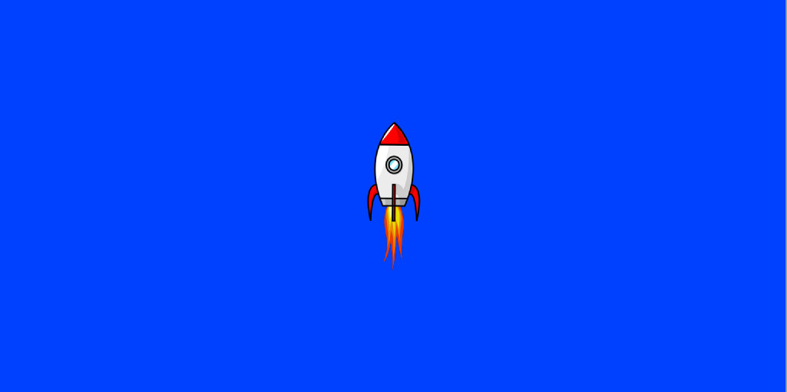

= Daddel - eine JavaFX-basierte 2D-Spieleengine

== Am Anfang ist der Berg immer höher als man nachher denkt...

[.lead]
Mit den eigenen Händen kreativ aus dem Nichts etwas neues, schönes zu schaffen, das macht für viele (und auch mich) den Reiz des Programmierens aus. 

Diese Freude (den eigenen) Kindern zu vermitteln, ist nicht ganz so leicht. Es gibt reihenweise Ansätze und Modelle: Turtle-Grafics, Maus-im-Labyrinth-Umgebungen, Mincraft-API, Scratch, Lego-Robotics etc.

Auf der Suche nach der besten Einsteigersprache landen viele bei Python, da diese auch rein funktioniale Programmierung möglich macht, und von der Syntax recht schlank ist.

Nun hat mein jüngerer Sohn entschieden, dass Java die Sprache seiner Wahl ist. Java: komplexe Syntax mit vielen Klammern, dem "alles-ist-eine-Klasse"-Paradigma und der ungezählten Vielfalt an Frameworks in allen Bereichen.

Motiviert mit Java in die Programmierung einzusteigen, stellt Informatiker wie Schüler (oder Eltern, Onkels, Kinder etc.) vor einige klitzekleine Herausforderungen:

|===
| nämlich... | ...und was Daddel bieten möchte

|ein Grundverständnis der Java-Sprachkonstrukte
|durch aufeinander aufbauende bereitgestellten Beispiele wird Java-Wissen (im Ansatz) nebenbei aufgebaut

|interessante Aufgaben sollten ohne große Klassenhierarchie lösbar, aber nicht darauf eingeschränkt sein
|Daddel stellt eine Builder- und Runner-API breit, die einen funktionalen Ansatz unterstützt. Trotzdem ist es echtes Java, daraus kann voll geschöpft werden.
 
|schnell und einfach ein vorzeigbares Ergebnis produzieren können
|Konvention steht über Konfiguration (ja, es gibt kein Framework ohne diesen Satz!), d.h. mit minimalem Code lassen sich anschauliche Ergebnisse erzielen. Einige Grafiken (siehe https://www.openclipart.org) und Sounds (u.a. von https://www.zapsplat.com) werden bereits mitgeliefert.

|nicht in der Gestaltungsfreiheit eingeschränkt zu sein
|Funktion und Verhalten der API können erweitert und überschrieben werden

|===

*Übrigens:* Dies ist keine Web-Anwendung. Man kann sie nicht im Browser ansehen. Es gibt auch keinen Zurück-Button, denn:
Im Hintergrund arbeitet *JavaFx*, also *Oracles moderne* und *native Desktop-Grafik-API*.

== Screenshots

 

 

 

== Losdaddeln

Für den Anfang erstellen wir eine Spielraster von der Größe 20 x 10. Der Hintergrund soll ein schönes Himmelblau sein und davor fliegt eine Rakete.

Hier das geplante Spielraster - die Rakete ist durch einen einfachen Kreis dargestellt:

Das Programm dazu ist schnell erstellt.

.Losdaddeln.java
[source,java]
----
package de.dreierschach.tutorial;

import de.dreierschach.daddel.Daddel;
import de.dreierschach.daddel.gfx.sprite.Particle;
import javafx.scene.input.KeyCode;
import javafx.scene.paint.Color;

public class Losdaddeln extends Daddel {

	@Override
	public void initGame() {
		grid(-10, 10, -5, 5); // <1>
		background(Color.rgb(0, 64, 255)); // <2>
		toLevel(() -> { // <3>
			sprite(1, 4, GFX_ROCKET); // <4>
			key(KeyCode.ESCAPE, keyCode -> exit()); // <5>
		});
	}

	public static void main(String[] args) { // <6>
		launch(args);
	}
}
----

<1> Definiert das Spielraster (x0, x1, y0, y1)
<2> Hintergrundfarbe des Spiels
<3> Es gibt im Spiel verschiedene Phasen (z.B. Titel, Highscore etc.), für die jeweils ein Bildschirm aufgebaut werden muss. Hier wird als einzige Phase ein Level-Bildschirm aufgebaut.
<4> Die Rakete ist ein Sprite, mit einem selbstdefinierten Typ 1, der Größe 4 (in Spielraster-Punkten) und einer bereits mitgelieferten Grafik
<5> Ein Druck auf die Taste ESCAPE sorgt dafür, dass das Spiel sofort beendet wird
<6> Diese Methode muss für jedes Spiel standartmäßig vorhanden sein, damit es überhaupt starten kann.

Das wars schon. Nach Start des Programms erscheint die Rakete vor strahlend blauem Himmel.
(Übrigens: Durch drücken von F3 kannst du durch die einzelnen Debug-Modi durchschalten.)

== nochmal Losdaddeln

Das ist noch ein wenig langweilig. Jetzt wollen wir etwas Action wagen. Wie wärs mit einem Pacman, der einen Banner hinter sich herzieht?

Dazu ergänzen wir das Programm um zwei Befehle. Einer für Pacman, einer für das Banner.

.Losdaddeln2.java
[source,java]
----
...
		toLevel(() -> {
			sprite(1, 4, GFX_ROCKET);

			Particle pacman = // <1>
				particle(1, 8000, 1.5, GFX_PAC_PACMAN_L0, GFX_PAC_PACMAN_L1, GFX_PAC_PACMAN_L2, GFX_PAC_PACMAN_L3) // <2>
				.pos(-11, 3) // <3>
				.rotation(180) // <4>
				.speed(4) // <5>
				.endOfLife(PARTICLE_RESTART) // <6>
				.outsideGrid(PARTICLE_IGNORE); // <7>

			text(". . . los-daddeln", "sans-serif", 1, Color.WHITE) // <8>
				.parent(pacman).pos(-1.5, 0) // <9>
				.align(ALIGN_RIGHT, VALIGN_CENTER); // <10>

			key(KeyCode.ESCAPE, keyCode -> exit());
		});
...
----

<1> Pacman ist ein Partikel, d.i. ein Sprite, der automatisch animiert wird.
<2> Der Typ ist wieder 1, die Lebensdauer beträgt 8000 ms (1 Sekunde) und die Größe ist 1.5 Spielraster-Punkte. Zu Pacman gehören vier Grafiken. Er soll ja fressen können ;-)
<3> Die Start-Position des Pacman ist unterhalb der Rakete und links außerhalb des Bildschirms.
<4> In den Grafiken schaut Pacman nach links, also muss das Bild um 180 Grad gedreht werden.
<5> Die Geschindigkeit soll 4 Spielraster-Punkte pro Sekunde betragen. Bei 8 Sekunden Lebensdauer reicht das, um einmal über den ganzen Bildschirm zu laufen.
<6> Wenn die Lebenszeit von Pacman abgelaufen ist, soll er wieder von vorne starten.
<7> Pacman soll ganz aus dem Bildschirm laufen können, deshalb wird ein verlassen des Rasters ignoriert.
<8> Das Banner hat u.a. die Größe 1 in Spielrasterpunten.
<9> Und es soll hinter Pacman herfliegen. Deshalb ist es ein "Kind" von Pacman und liegt relativ gesehen 1.5 Spielrasterpunkte links davon.
<10> Die Ausrichtung des Banners soll rechtsbündig sein.

Und so sieht es jetzt aus:

